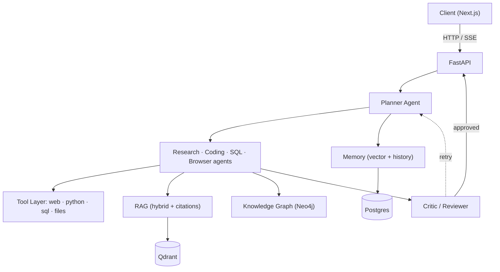

# Enterprise Agentic AI OS


> A production-grade, multi-agent AI platform that reasons, plans, and executes complex tasks over enterprise data — with retrieval, tool use, long-term memory, and a real evaluation harness.

**Status:** 🚧 In active development. Building in public — one commit a day.

---

## Why this project

Most "AI agent" portfolios wire tutorials together and can't prove anything works. This one is built around **measurement**: every capability ships with an automated evaluation and real numbers (task success rate, latency, cost per task, citation accuracy).

## Architecture



Full diagrams (request lifecycle, evaluation loop) in [docs/architecture.md](docs/architecture.md) · design & trade-offs in [docs/DESIGN.md](docs/DESIGN.md).

## Tech stack

| Layer | Choice |
|---|---|
| LLM | Qwen / Llama (fine-tuned via LoRA) + hosted API |
| Agents | LangGraph |
| Backend | FastAPI |
| Vector DB | Qdrant |
| Knowledge Graph | Neo4j |
| Database | PostgreSQL |
| Observability | Langfuse + OpenTelemetry + Prometheus/Grafana |
| Frontend | Next.js + TypeScript |

## Evaluation (results will appear here)

| Metric | Baseline | Current |
|---|---|---|
| Retrieval recall@5 | — | — |
| Answer correctness | — | — |
| Citation accuracy | — | — |
| Multi-step task success | — | — |
| p95 latency | — | — |
| Cost / task | — | — |

## API (current)

| Method | Path | Description |
|---|---|---|
| GET | `/health` | Liveness probe |
| GET | `/config` | Non-secret runtime config |
| POST | `/chat` | Single-turn chat with the configured LLM |

## Quickstart

```bash
git clone https://github.com/zda25m005-netizen/agentic-ai-os.git
cd agentic-ai-os
cp .env.example .env
make install
make run
```

## Roadmap

See [docs/DESIGN.md](docs/DESIGN.md). Built over ~4 months, daily commits.

## License

MIT — see [LICENSE](LICENSE).
