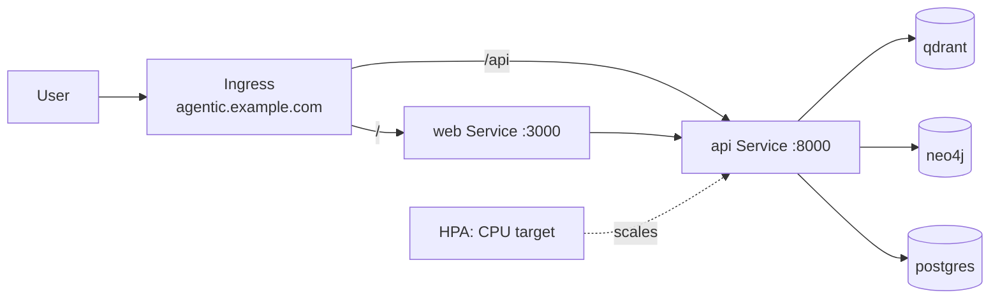

# agentic-ai-os Helm chart

Templated deployment of the full stack (API, web, and the three datastores) with
per-environment values.

## Install / render / lint
```bash
helm lint charts/agentic
helm template agentic charts/agentic          # render manifests to stdout
helm install agentic charts/agentic           # deploy to the current context
helm upgrade agentic charts/agentic -f prod-values.yaml
```

## Config vs secrets
Non-secret config lives in `config` (rendered to a **ConfigMap**); credentials
live in `secrets` (rendered to an **Opaque Secret**). Both are mounted on the API
pod via `envFrom`, so no secret is ever inlined in the Deployment. Defaults for
`secrets` are **empty** and no real keys are committed (enforced by
`tests/test_helm_config_secrets.py`).

Inject secrets only at deploy time:
```bash
helm upgrade --install agentic charts/agentic -f charts/agentic/values-prod.yaml \
  --set secrets.OPENAI_API_KEY="$OPENAI_API_KEY" \
  --set secrets.JWT_SECRET="$JWT_SECRET"
```
For real clusters, prefer an external secret manager (Sealed Secrets,
External Secrets Operator, or your cloud's Secrets Manager) over `--set`.

## Values reference
| Key | Default | Meaning |
|---|---|---|
| `image.pullPolicy` | `IfNotPresent` | Image pull policy for all pods |
| `config` | (map) | Non-secret env -> ConfigMap (QDRANT_URL, NEO4J_URI, DATABASE_URL, LLM_MODEL, ...) |
| `secrets` | (empty) | Secret env -> Opaque Secret (OPENAI_API_KEY, JWT_SECRET) |
| `api.image` | `agentic-ai-os-api:latest` | Backend image |
| `api.replicas` | `2` | Backend replica count |
| `api.port` | `8000` | Backend container/service port |
| `api.resources` | requests/limits | CPU/memory requests + limits |
| `web.image` | `agentic-ai-os-web:latest` | Frontend image |
| `web.replicas` | `2` | Frontend replica count |
| `web.port` | `3000` | Frontend port |
| `web.apiBase` | `http://api:8000` | Browser-facing API base URL |
| `datastores.qdrant.image` / `.storage` | `qdrant/qdrant:latest` / `5Gi` | Vector DB image + PVC size |
| `datastores.neo4j.image` / `.storage` / `.auth` | `neo4j:5-community` / `5Gi` / `neo4j/neo4jpassword` | Graph DB |
| `datastores.postgres.image` / `.storage` / creds | `postgres:16-alpine` / `5Gi` | Memory DB |
| `ingress.enabled` / `ingress.host` | `false` / `agentic.local` | Ingress toggle + host (Day 27) |

## Networking + autoscaling

With `ingress.enabled=true`, one Ingress fronts both services: `/` → web,
`/api` → api. Inside the cluster, everything talks over stable Service DNS
(`api`, `web`, `qdrant`, `neo4j`, `postgres`). With `autoscaling.enabled=true`, a
HorizontalPodAutoscaler scales the API on CPU (`targetCPUUtilizationPercentage`).



Both are **off by default** (dev) and **on in `values-prod.yaml`**.

## Notes
- Secrets are injected at deploy time and never committed (see above).
- Structure is validated by `tests/test_helm_chart.py`; run `helm lint` locally
  for the full check.
