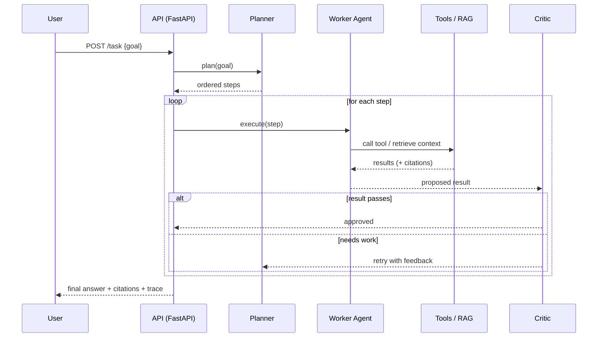
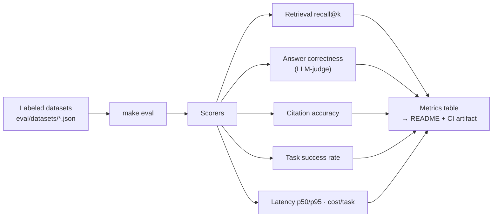

# Architecture

Diagrams render automatically on GitHub (Mermaid).

## System overview

```mermaid
flowchart TB
    UI["Client<br/>(Next.js chat + dashboard)"] -->|HTTP / SSE| API["FastAPI<br/>auth · rate limit · streaming"]

    API --> PL["Planner Agent<br/>decompose goal into steps"]

    PL --> RES["Research Agent"]
    PL --> COD["Coding Agent"]
    PL --> SQL["Data / SQL Agent"]
    PL --> BR["Browser Agent"]

    RES --> TL["Tool Layer"]
    COD --> TL
    SQL --> TL
    BR --> TL

    TL --> T1["Web search"]
    TL --> T2["Python exec"]
    TL --> T3["SQL"]
    TL --> T4["File ops"]

    RES --> RAG["RAG<br/>hybrid search + citations"]
    RES --> KG["Knowledge Graph<br/>Neo4j"]
    PL --> MEM["Memory<br/>vector + task history"]

    RAG --> VDB[("Qdrant")]
    MEM --> VDB
    MEM --> PG[("Postgres")]
    KG --> NEO[("Neo4j")]

    RES --> CR["Critic / Reviewer<br/>validate → retry or finish"]
    COD --> CR
    SQL --> CR
    CR -->|approved| API
    CR -.->|retry (max N)| PL

    API --> OBS["Observability<br/>Langfuse · OTel · Prometheus"]
```

## Request lifecycle (a single task)



## Evaluation loop (how we prove it works)



See [DESIGN.md](DESIGN.md) for component details and trade-offs.
