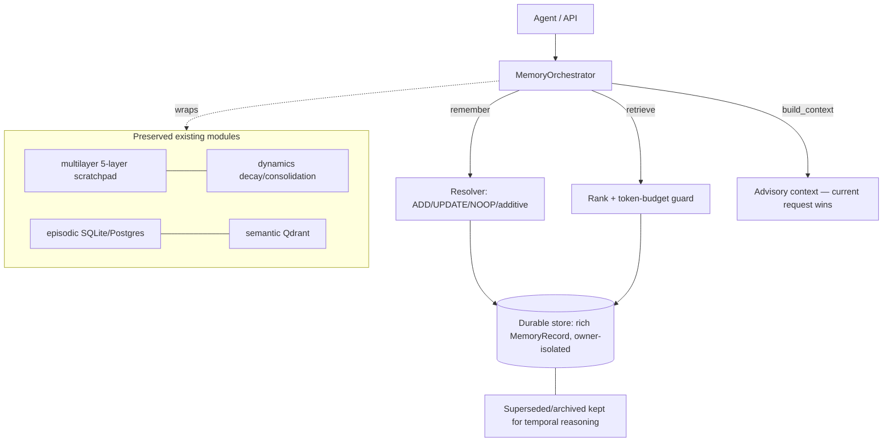
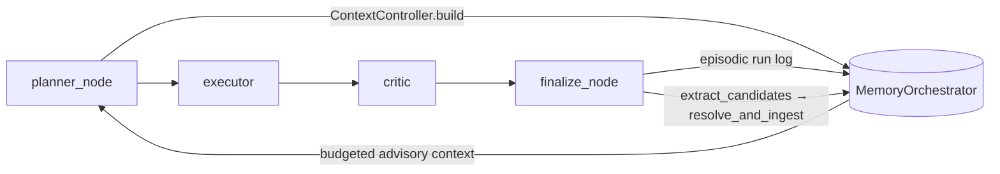

# Agentic Memory Engine

Upgrade of the memory subsystem toward a hierarchical + agentic memory engine.
Delivered **incrementally**; this document marks what is real today vs. planned.
No paper benchmarks are reproduced or claimed.

## Status

| Area | Status |
|---|---|
| Canonical `MemoryOrchestrator` (single entry point) | **Implemented** |
| Rich memory object model + lifecycle (provenance, temporal validity, status) | **Implemented** |
| Durable, owner-isolated record store (SQLite) | **Implemented** |
| Deterministic resolver: ADD / UPDATE(supersede) / NOOP(reinforce) + additive keep-both | **Implemented** |
| Retrieval ranking + token-budget guard + advisory context | **Implemented** |
| `/memory` HTTP API + Memory UI on real records (no more sample data) | **Implemented** |
| Eval harness (local LongMemEval-style fixtures) + metrics + ablation runner | **Implemented** |
| `MEMORY_POLICY_MODE` config (`deterministic` default) | **Implemented** |
| Mem0-style lifecycle (extract candidates → retrieve-similar → resolve) wired into `finalize_node` | **Implemented** (config D) |
| MemGPT-style context controller (budget/prioritize/evict) wired into `planner_node` | **Implemented** (config D) |
| Optional LLM candidate extraction (`MEMORY_POLICY_MODE=llm`, deterministic fallback) | **Implemented** |
| Graph memory (owner-scoped entity/relationship, reuse `app/graph` Neo4j client) | **Implemented** (config E) |
| Pluggable resolver policy (deterministic default; learned policy behind one interface) | **Implemented** (config F) |
| RL memory policy: GRPO trainer + decision env + weights, wired into the resolver | **Implemented / Experimental** (config F) |
| Six-action trajectory memory control (STORE/RETRIEVE/UPDATE/SUMMARIZE/DISCARD/NOOP) | **Implemented** (config G) |
| Open-weight LLM memory policy (+ optional LoRA/QLoRA adapter), heuristic fallback | **Implemented** (config G) |
| GRPO training of the LLM policy on agent trajectories (LoRA/QLoRA, lazy `finetune` extra) | **Implemented / Experimental** (config G) |
| Honest separated metrics (policy-action / retrieval / temporal / task / tokens / latency) | **Implemented** (config G) |

## Architecture (implemented core)



## Agent wiring (config D)

The Mem0 lifecycle and MemGPT context controller are wired into the **real LangGraph
execution path**, not exposed as standalone classes:



- **`planner_node`** — when an orchestrator is installed, a `ContextController`
  (`app/memory/context.py`) retrieves + budgets memory into an advisory block injected
  into the plan prompt. The goal is never overridden; over-long items are clipped (evicted).
- **`finalize_node`** — logs the run episodically, then runs the Mem0 lifecycle
  (`app/memory/lifecycle.py`): extract candidate facts from goal+answer, retrieve similar
  memories, and resolve to ADD / UPDATE(supersede) / NOOP(reinforce).
- **Safe fallback.** When no orchestrator is installed (`MEMORY_POLICY_MODE=off`, and every
  existing test), both nodes fall back to the legacy `MemoryManager` path — so all prior
  behavior and tests are preserved.

## Graph memory (config E)

An optional entity/relationship layer (`app/memory/graph_memory.py`, Mem0g-style) that
reuses the existing `app/graph` stack — the same LLM extraction (`extract_graph`) and the
same Neo4j client (`run_query` / `verify_connectivity`). Durable facts are projected into
an **owner-scoped** namespace (`:MemEntity` / `:MEM_RELATION`, distinct from the document
RAG graph's `:Entity` / `:RELATION`), and recall traverses only the current owner's subgraph.

- **`finalize_node`** — after the Mem0 lifecycle, also calls `GraphMemory.ingest_text(...)`
  to MERGE the run's entities/relations (idempotent, owner-scoped).
- **`planner_node`** — calls `GraphMemory.related(goal)` and appends the returned triples as
  a second, clearly-labelled *advisory* block alongside the MemGPT context.
- **Optional + graceful.** Gated by `MEMORY_GRAPH_ENABLED` (default **off**) and only active
  when a live Neo4j answers `verify_connectivity`. Otherwise every call is a safe no-op —
  ingest returns zeros, recall returns empty — so the agent, the `/memory/graph` endpoint,
  and the whole test suite run unchanged without a graph database. Unit-tested end-to-end
  with a fake driver (`tests/test_graph_memory.py`); no live Neo4j required in CI.
- **Owner isolation.** Every MATCH/MERGE filters on `$owner`; one owner's graph is never
  traversed for another (tested).

## RL memory policy (config F, experimental)

The Mem0 resolver's `NOOP / UPDATE / ADD` decision is factored out behind a one-method
interface (`app/memory/policy.py`) so the *same* lifecycle code can run either the
hand-written rules or a learned policy:

- **`DeterministicPolicy`** reproduces the original threshold logic byte-for-byte and is the
  default. `resolve_and_ingest` builds one when no policy is passed, so all prior behavior
  and tests are unchanged.
- **`LinearPolicy`** is a numpy softmax over a small feature vector (similarity, correction
  cue, has-neighbor, exact-match) — inference needs only numpy, no torch/trl. Illegal
  actions (UPDATE/NOOP with no neighbor) are clamped to ADD.
- **Training** (`app/memory/rl/`): a labelled one-step decision env (`env.py`) with rewards
  shaped from the engine's own failure modes (stale leak penalised hardest), and a minimal
  **GRPO** trainer (`grpo.py`) whose defining move is the *group-relative advantage* — sample
  a group of actions per state, standardize their rewards within the group (no critic), and
  push toward the above-average ones. Seeded and offline; `python -m app.memory.rl.train`
  writes `memory_policy.json` and prints a report.
- **Wired in:** `finalize_node` calls `get_policy(MEMORY_POLICY_MODE, weights_path=...)` and
  passes it to the resolver. With `MEMORY_POLICY_MODE=rl` and a weights file present, the
  learned policy makes the decision; otherwise it falls back to deterministic — so the safe
  path is always the default.

On the local fixtures the GRPO policy converges (mean greedy reward ≈ 0.18 → 0.95, and
**policy action accuracy** ≈ 0.97 — i.e. it picks the correct ADD/UPDATE/NOOP op ~97% of
the time, which is *not* the same thing as retrieval accuracy or task success; see the
metrics section). Run through the eval harness (`evaluate("rl_policy")`) it recovers
config-D quality (precision 0.875, recall 1.0, zero stale leaks) — it learned the resolve
decision from reward alone. This is honest, small-scale plumbing: a linear policy over a
3-action decision on hand-written fixtures, **not** a reproduction of GRPO on an LLM or any
published benchmark.

## LLM memory policy over agent trajectories (config G, experimental)

Config F's learned policy is a toy: a linear model over a 3-action decision. Config G is the
real research layer — a small **open-weight LLM** (default `Qwen/Qwen2.5-0.5B-Instruct`),
optionally fine-tuned with a **LoRA/QLoRA** adapter, that manages memory over a richer
six-action space, trained by GRPO on actual agent trajectories.

```
                    Agent trajectory
                           ↓
                  Memory Environment            app/memory/trajectory/env.py
                           ↓
                 ┌─────────┴─────────┐
                 ↓                   ↓
             Observation          Memory state
                 ↓                   ↓
                 └─────────┬─────────┘
                           ↓
                    LLM Memory Policy           app/memory/llm_policy.py
                           ↓
             STORE / RETRIEVE / UPDATE
             SUMMARIZE / DISCARD / NOOP         app/memory/trajectory/actions.py
                           ↓
                       Reward                   app/memory/trajectory/env.py::step_reward
                           ↓
                         GRPO                   app/memory/rl/llm_grpo.py
                           ↓
                    LoRA / QLoRA                peft adapter (finetune extra)
                           ↓
                 Trained Memory Policy
```

- **Six-action space** (`app/memory/trajectory/actions.py`): STORE, RETRIEVE, UPDATE,
  SUMMARIZE, DISCARD, NOOP. `op_to_resolver_action` projects it onto the resolver's
  ADD/UPDATE/NOOP so the *same* policy object can also drive the existing Mem0 lifecycle.
- **Environment + trajectories** (`trajectory/env.py`, `trajectory/dataset.py`): labelled
  agent-trajectory decision steps with rewards shaped from real failure modes — information
  loss, stale leak, and missed retrieval penalised hardest; pollution and token bloat less so.
- **Policy** (`llm_policy.py`): `LLMMemoryPolicy` builds a prompt from the observation +
  memory state, generates, and parses one op. `transformers`/`peft`/`torch` are imported
  **lazily**; when they're absent (the default runtime and CI) it falls back to a
  dependency-free `HeuristicPolicy` — a strong six-action baseline (~0.98 action accuracy on
  the fixtures) that is also the resolver fallback.
- **GRPO + LoRA/QLoRA training** (`rl/llm_grpo.py`): group-relative advantage on the action
  token log-probs, updating only the LoRA adapter (or a 4-bit QLoRA base). The heavy stack is
  lazy; calling `train()` without it raises a clear "install `.[finetune]`" error rather than
  breaking imports. The advantage math (`group_advantages`) is pure-numpy and unit-tested.
- **Disabled by default.** Activated only by `MEMORY_POLICY_MODE=rl` + `MEMORY_POLICY_BACKEND=llm`;
  otherwise the deterministic policy runs and nothing loads torch.

### Metrics — kept honest and separate

A single "accuracy" number would be misleading, so `app/memory/metrics_suite.py` computes and
reports these as **distinct, independently-named** quantities (never collapse them):

| Metric | What it measures |
|---|---|
| `policy_action_accuracy` | did the policy pick the right OP (STORE/UPDATE/…)? |
| `memory_retrieval_accuracy` | precision / recall / F1 of what it pulled back |
| `temporal_update_accuracy` | on corrections, did the new value win and the stale one go? |
| `task_success` | did the downstream task actually get answered? |
| `token_efficiency` | context tokens the memory cost vs. a no-compression baseline |
| `latency` | wall-clock cost (mean / p50 / p95) of the memory decisions |

The "~97% action accuracy" figure for config F/G is **policy action accuracy on the local
decision env** — a specific, narrow claim. It is *not* retrieval accuracy, temporal-update
accuracy, or task success, and the code/docs never label it "memory accuracy".

To train the real adapter on a GPU/CPU box:

```
pip install -e ".[finetune]"
python -c "from app.memory.rl.llm_grpo import LLMGRPOTrainer; \
           print(LLMGRPOTrainer(quantized=True).train(epochs=1, out_dir='mem_lora'))"
# then run it: MEMORY_POLICY_MODE=rl MEMORY_POLICY_BACKEND=llm MEMORY_LORA_ADAPTER=mem_lora
```

## Guarantees (encoded + tested)

- **Current request is authoritative.** `build_context` returns memory clearly labelled
  *advisory — the current request takes precedence*; retrieval never emits hard constraints.
- **No blind overwrite.** A differing value only supersedes an existing keyed fact when its
  confidence ≥ the stored one (an explicit correction). Lower-confidence differing values are
  kept as additive notes.
- **History preserved.** Superseded/forgotten records move to `superseded`/`archived` and stay
  queryable — never hard-deleted (except explicit user erasure via `forget(hard=True)`).
- **Retrieval cannot overflow the budget.** `retrieve(token_budget=…)` enforces the cap.
- **Owner isolation.** Every record carries an `owner`; the store filters by it — no cross-user leakage.

## Configuration

- `MEMORY_BACKEND` — `sqlite` (default) | `postgres` (existing episodic backend).
- `MEMORY_POLICY_MODE` — `deterministic` (default, always works) | `llm` | `rl` (experimental, gated).
- `MEMORY_GRAPH_ENABLED` — `false` (default) | `true`. When true and a live Neo4j answers,
  graph memory (config E) ingests + recalls owner-scoped triples; otherwise it is a no-op.
- `MEMORY_POLICY_WEIGHTS` — path to the trained RL policy weights (config F, default
  `memory_policy.json`). Used only when `MEMORY_POLICY_MODE=rl`; missing/invalid → deterministic.
- `MEMORY_POLICY_BACKEND` — `linear` (config F, numpy) | `llm` (config G, open-weight LLM +
  optional LoRA/QLoRA). Consulted only when `MEMORY_POLICY_MODE=rl`; the `llm` backend loads
  torch/transformers lazily and falls back to the heuristic when they are absent.
- `MEMORY_LLM_MODEL` / `MEMORY_LORA_ADAPTER` — base model id and optional adapter dir for the
  config-G LLM policy.
- Neo4j (`NEO4J_*`) and Qdrant (`QDRANT_URL`) remain optional; graph memory reuses the existing Neo4j client.

## Evaluation

`python -c "from app.memory.eval.ablation import run; import json; print(json.dumps(run(), default=str, indent=2))"`

Runs the local fixtures for **A (no memory)**, **C (orchestrator)**, **D (orchestrator +
Mem0 lifecycle + MemGPT context controller)**, and **F (D with the GRPO-trained resolver
policy)**. B requires a live Qdrant and E requires a live Neo4j, so both are skipped offline
(E's module + wiring exist and are unit-tested with a fake driver). F is experimental and runs
offline. No numbers are reported for configs that were not actually run. Metrics: precision,
recall, stale-leak, irrelevant-leak, retrieved tokens.

On the local fixtures, config D improves precision over C (0.708 → 0.875) and reduces
irrelevant-leak (3 → 1) at recall 1.0 with zero stale leaks. These are small hand-written
fixtures, **not** the published LongMemEval benchmark — no paper numbers are claimed.

## Files

- `app/memory/records.py`, `app/memory/store.py`, `app/memory/orchestrator.py`
- `app/memory/lifecycle.py` (Mem0), `app/memory/context.py` (MemGPT),
  `app/memory/graph_memory.py` (graph memory), `app/memory/policy.py` (pluggable resolver
  policy), `app/memory/rl/{env,grpo,train}.py` (config-F GRPO training) — wired into
  `app/agents/planner.py` and `app/agents/graph.py`
- `app/memory/trajectory/{actions,env,dataset,prompt}.py` (config-G six-action trajectory
  layer), `app/memory/llm_policy.py` (LLM policy + heuristic fallback),
  `app/memory/rl/llm_grpo.py` (GRPO + LoRA/QLoRA), `app/memory/metrics_suite.py` (honest metrics)
- `app/api/memory.py` (router incl. `/memory/graph`), registered in `app/api/main.py`
  (orchestrator installed in lifespan)
- `app/memory/eval/{dataset,metrics,harness,ablation}.py`
- `frontend/app/lib/memoryApi.ts` (now calls `/memory`)
- `tests/test_memory_orchestrator.py`, `tests/test_memory_eval.py`,
  `tests/test_memory_lifecycle.py`, `tests/test_memory_context.py`,
  `tests/test_memory_agent_wiring.py`, `tests/test_graph_memory.py`,
  `tests/test_memory_policy.py`, `tests/test_memory_rl.py`,
  `tests/test_trajectory_memory.py`, `tests/test_llm_policy.py`, `tests/test_metrics_suite.py`
