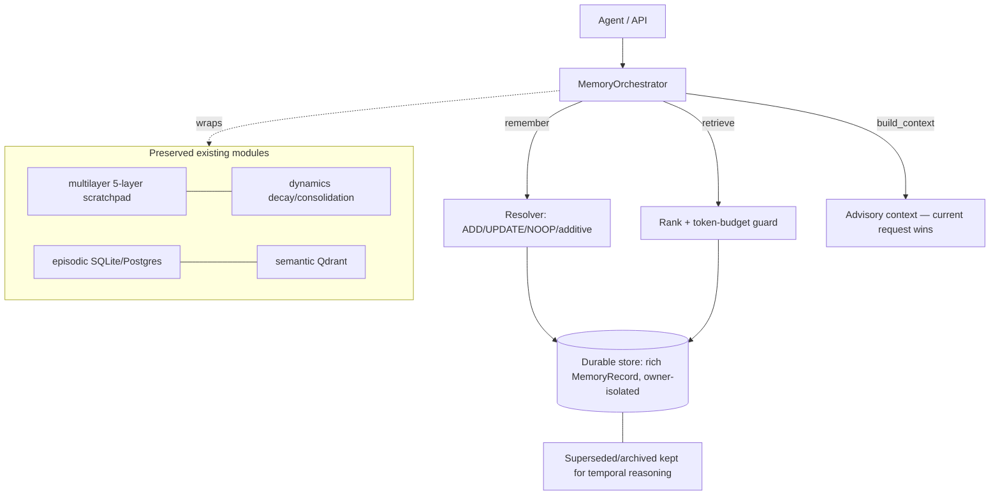
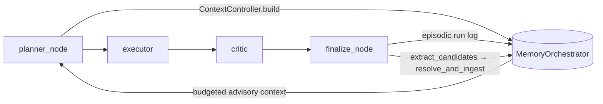

# Agentic Memory Engine

Upgrade of the memory subsystem toward a hierarchical + agentic memory engine.
Delivered **incrementally**; this document marks what is real today vs. planned.
No paper benchmarks are reproduced or claimed.

## Status

| Area | Status |
|---|---|
| Canonical `MemoryOrchestrator` (single entry point) | **Implemented** |
| Rich memory object model + lifecycle (provenance, temporal validity, status) | **Implemented** |
| Durable, owner-isolated record store (SQLite) | **Implemented** |
| Deterministic resolver: ADD / UPDATE(supersede) / NOOP(reinforce) + additive keep-both | **Implemented** |
| Retrieval ranking + token-budget guard + advisory context | **Implemented** |
| `/memory` HTTP API + Memory UI on real records (no more sample data) | **Implemented** |
| Eval harness (local LongMemEval-style fixtures) + metrics + ablation runner | **Implemented** |
| `MEMORY_POLICY_MODE` config (`deterministic` default) | **Implemented** |
| Mem0-style lifecycle (extract candidates → retrieve-similar → resolve) wired into `finalize_node` | **Implemented** (config D) |
| MemGPT-style context controller (budget/prioritize/evict) wired into `planner_node` | **Implemented** (config D) |
| Optional LLM candidate extraction (`MEMORY_POLICY_MODE=llm`, deterministic fallback) | **Implemented** |
| Graph memory (entity/relationship, reuse `app/graph` Neo4j client) | **Planned** (config E) |
| LLM / RL (GRPO) memory policy + training + RL env | **Planned / Experimental** (config F) |

## Architecture (implemented core)

## Agent wiring (config D)

The Mem0 lifecycle and MemGPT context controller are wired into the **real LangGraph
execution path**, not exposed as standalone classes:

- **`planner_node`** — when an orchestrator is installed, a `ContextController`
  (`app/memory/context.py`) retrieves + budgets memory into an advisory block injected
  into the plan prompt. The goal is never overridden; over-long items are clipped (evicted).
- **`finalize_node`** — logs the run episodically, then runs the Mem0 lifecycle
  (`app/memory/lifecycle.py`): extract candidate facts from goal+answer, retrieve similar
  memories, and resolve to ADD / UPDATE(supersede) / NOOP(reinforce).
- **Safe fallback.** When no orchestrator is installed (`MEMORY_POLICY_MODE=off`, and every
  existing test), both nodes fall back to the legacy `MemoryManager` path — so all prior
  behavior and tests are preserved.

## Guarantees (encoded + tested)

- **Current request is authoritative.** `build_context` returns memory clearly labelled
  *advisory — the current request takes precedence*; retrieval never emits hard constraints.
- **No blind overwrite.** A differing value only supersedes an existing keyed fact when its
  confidence ≥ the stored one (an explicit correction). Lower-confidence differing values are
  kept as additive notes.
- **History preserved.** Superseded/forgotten records move to `superseded`/`archived` and stay
  queryable — never hard-deleted (except explicit user erasure via `forget(hard=True)`).
- **Retrieval cannot overflow the budget.** `retrieve(token_budget=…)` enforces the cap.
- **Owner isolation.** Every record carries an `owner`; the store filters by it — no cross-user leakage.

## Configuration

- `MEMORY_BACKEND` — `sqlite` (default) | `postgres` (existing episodic backend).
- `MEMORY_POLICY_MODE` — `deterministic` (default, always works) | `llm` | `rl` (experimental, gated).
- Neo4j (`NEO4J_*`) and Qdrant (`QDRANT_URL`) remain optional; graph memory is planned and will reuse the existing optional Neo4j client.

## Evaluation

`python -c "from app.memory.eval.ablation import run; import json; print(json.dumps(run(), default=str, indent=2))"`

Runs the local fixtures for **A (no memory)**, **C (orchestrator)**, and **D (orchestrator +
Mem0 lifecycle + MemGPT context controller)**. B requires a live Qdrant and is skipped offline;
E/F are unbuilt and report **no** numbers. Metrics: precision, recall, stale-leak,
irrelevant-leak, retrieved tokens.

On the local fixtures, config D improves precision over C (0.708 → 0.875) and reduces
irrelevant-leak (3 → 1) at recall 1.0 with zero stale leaks. These are small hand-written
fixtures, **not** the published LongMemEval benchmark — no paper numbers are claimed.

## Files

- `app/memory/records.py`, `app/memory/store.py`, `app/memory/orchestrator.py`
- `app/memory/lifecycle.py` (Mem0), `app/memory/context.py` (MemGPT) — wired into
  `app/agents/planner.py` and `app/agents/graph.py`
- `app/api/memory.py` (router), registered in `app/api/main.py` (orchestrator installed in lifespan)
- `app/memory/eval/{dataset,metrics,harness,ablation}.py`
- `frontend/app/lib/memoryApi.ts` (now calls `/memory`)
- `tests/test_memory_orchestrator.py`, `tests/test_memory_eval.py`,
  `tests/test_memory_lifecycle.py`, `tests/test_memory_context.py`,
  `tests/test_memory_agent_wiring.py`
