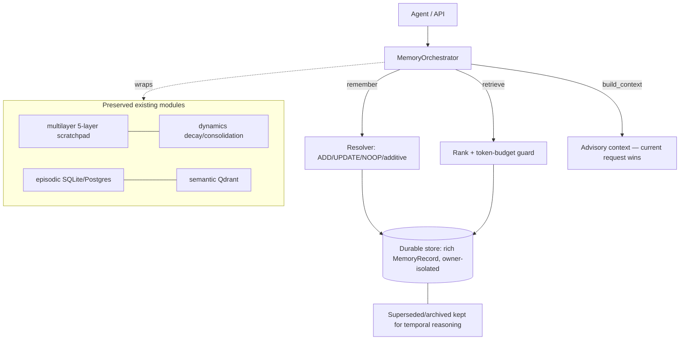

# Agentic Memory Engine

Upgrade of the memory subsystem toward a hierarchical + agentic memory engine.
Delivered **incrementally**; this document marks what is real today vs. planned.
No paper benchmarks are reproduced or claimed.

## Status

| Area | Status |
|---|---|
| Canonical `MemoryOrchestrator` (single entry point) | **Implemented** |
| Rich memory object model + lifecycle (provenance, temporal validity, status) | **Implemented** |
| Durable, owner-isolated record store (SQLite) | **Implemented** |
| Deterministic resolver: ADD / UPDATE(supersede) / NOOP(reinforce) + additive keep-both | **Implemented** |
| Retrieval ranking + token-budget guard + advisory context | **Implemented** |
| `/memory` HTTP API + Memory UI on real records (no more sample data) | **Implemented** |
| Eval harness (local LongMemEval-style fixtures) + metrics + ablation runner | **Implemented** |
| `MEMORY_POLICY_MODE` config (`deterministic` default) | **Implemented** |
| Mem0-style candidate extraction from raw conversation (LLM) | **Planned** (config D) |
| MemGPT-style context controller wired into the agent loop | **Planned** |
| Graph memory (entity/relationship, reuse `app/graph` Neo4j client) | **Planned** (config E) |
| LLM / RL (GRPO) memory policy + training + RL env | **Planned / Experimental** (config F) |

## Architecture (implemented core)

## Guarantees (encoded + tested)

- **Current request is authoritative.** `build_context` returns memory clearly labelled
  *advisory — the current request takes precedence*; retrieval never emits hard constraints.
- **No blind overwrite.** A differing value only supersedes an existing keyed fact when its
  confidence ≥ the stored one (an explicit correction). Lower-confidence differing values are
  kept as additive notes.
- **History preserved.** Superseded/forgotten records move to `superseded`/`archived` and stay
  queryable — never hard-deleted (except explicit user erasure via `forget(hard=True)`).
- **Retrieval cannot overflow the budget.** `retrieve(token_budget=…)` enforces the cap.
- **Owner isolation.** Every record carries an `owner`; the store filters by it — no cross-user leakage.

## Configuration

- `MEMORY_BACKEND` — `sqlite` (default) | `postgres` (existing episodic backend).
- `MEMORY_POLICY_MODE` — `deterministic` (default, always works) | `llm` | `rl` (experimental, gated).
- Neo4j (`NEO4J_*`) and Qdrant (`QDRANT_URL`) remain optional; graph memory is planned and will reuse the existing optional Neo4j client.

## Evaluation

`python -c "from app.memory.eval.ablation import run; import json; print(json.dumps(run(), default=str, indent=2))"`

Runs the local fixtures for **A (no memory)** vs **C (orchestrator)**. B requires a live Qdrant
and is skipped offline; D/E/F are unbuilt and report **no** numbers. Metrics: precision, recall,
stale-leak, irrelevant-leak, retrieved tokens.

## Files

- `app/memory/records.py`, `app/memory/store.py`, `app/memory/orchestrator.py`
- `app/api/memory.py` (router), registered in `app/api/main.py`
- `app/memory/eval/{dataset,metrics,harness,ablation}.py`
- `frontend/app/lib/memoryApi.ts` (now calls `/memory`)
- `tests/test_memory_orchestrator.py`, `tests/test_memory_eval.py`
